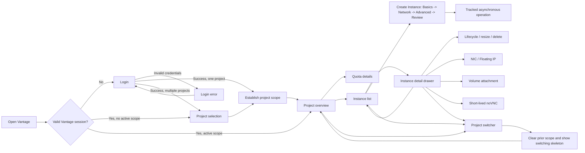

# Goal 1 Screen and Interaction Specification

Status: design-ready
Baseline: OpenStack 2026.1
Scope: project-user initial MVP

Goal 1 is a complete usable slice, not two overview mockups. Penpot contains
the real login, selection, quota, inventory, provisioning, lifecycle, network,
storage, console, and failure surfaces. This document defines how users move
between them and what every command returns.

## User Flow

Any authenticated route can transition to the blocking session-expired dialog.
Any service-backed surface can independently show loading, empty, permission
denied, partial failure, or stale-data state.

## Route Contract

| Browser route | Entry condition | Primary data | Result |
| --- | --- | --- | --- |
| `/login` | No valid Vantage session | None | Session or inline authentication error |
| `/projects/select` | Valid session without active scope | `GET /api/v1/projects` | `PUT /api/v1/scope`, then `/overview` |
| `/overview` | Valid active scope | `GET /api/v1/overview` | Quota-first project view |
| `/quotas` | Valid active scope | `GET /api/v1/quotas` | Detailed service quota table |
| `/instances` | Valid active scope | `GET /api/v1/instances` | Filtered cursor page |
| `/instances/:id` | Valid active scope | List state plus `GET /api/v1/instances/:id` | Right drawer over preserved list |
| `/instances/new` | Valid active scope and create capability | Server-side Images, Flavors, networks, security groups, and keypairs | Three-step create flow |
| `/images` | Valid active scope | `GET /api/v1/images` | Project/public image inventory |
| `/keypairs` | Valid active scope | `GET /api/v1/keypairs` | Project keypair inventory |
| `/networks` | Valid active scope | `GET /api/v1/networks` | Goal 1 network selector/inventory |
| `/floating-ips` | Valid active scope | `GET /api/v1/floating-ips` | Allocation and association inventory |
| `/volumes` | Valid active scope | `GET /api/v1/volumes` | Attach-eligible project volume inventory |
| `/operations/:id` | Accepted asynchronous command | `GET /api/v1/operations/:id` | Pending, success, failure, and request IDs |

The active project and region live in the server session, not a browser token.
A deep link without a session goes to `/login`. A valid session without a scope
goes to `/projects/select`, then returns to the original safe route after scope
selection.

## Screen Contract

### Login

- Submit uses `POST /api/v1/session/login`.
- The button keeps a fixed width and moves through `Sign in`, `Signing in`,
  then either route transition or the inline error banner.
- Duplicate submission is disabled while the request is pending.
- `401` highlights the credential fields without revealing which credential
  failed. `429` shows the retry window. Password values are cleared after
  failure and never written to telemetry.
- One accessible project can be scoped immediately. Multiple projects open the
  explicit project-selection screen.

### Project Selection

- Search is server-side and debounced; the result list never triggers quota
  requests for every project.
- Rows use project name, domain, enabled state, and locally stored last-opened
  time. Last-opened time is convenience metadata, not authorization data.
- `Continue` disables repeat input, calls `PUT /api/v1/scope`, clears all
  previous-scope caches, and opens `/overview`.
- A failed scope request leaves the selected row visible and shows the
  normalized problem plus request ID.

### Project Switcher

- Clicking the project name opens an attached popover.
- Arrow keys move the active row; `Enter` selects; `Escape` and outside click
  close it. Focus returns to the header trigger.
- Switching closes an instance drawer, invalidates prior-project queries, and
  replaces project content with stable switching skeletons.
- No prior-project row, count, or error remains visible after the new scope is
  accepted.

### Project Overview

- The shell renders independently from service data.
- Nova, Neutron, and Cinder quota requests run behind one BFF deadline and
  return independent widget results.
- Quota pressure uses `used + reserved` when the service exposes reserved
  usage. Unlimited quotas display `Unlimited`, never a fabricated percentage.
- `View all quotas` opens `/quotas`. Workload `View all` opens `/instances`.
- A failed service replaces only its own widget and includes an OpenStack
  request ID when available.

### Quota Details

- Service tabs filter already returned bounded quota rows; text filtering is
  local because the resource set is finite.
- Columns are service, resource, used, reserved, limit, usage, and pressure.
- `Watch` begins at 70 percent and `High` at 85 percent by default. These are
  quota-presentation thresholds, not service health or OpenStack policy.
- A missing service keeps successful service rows and presents a retry action
  only for the failed service.

### Instance List

- Search, status, image, sort, and pagination are BFF parameters and are passed
  to supported upstream server-side filters.
- The page-size control offers exactly 10, 25, 50, and 100 rows. The default is
  25. The footer shows a result range and `‹ 1 2 3 … ›`; text
  `Previous`/`Next` controls are not used. Filter or page-size changes return
  to page 1 and invalidate the BFF cursor chain. Browser back/forward restores
  filters, visible page, page size, selection, and scroll position.
- Rows keep a stable 48 px minimum target. Selecting a name or row opens the
  detail route without unloading the list.
- Empty means a successful page with zero items. Permission denied and service
  failure are not rendered as empty.

### Instance Detail

- The route opens a right drawer over the preserved list.
- Close icon, backdrop, `Escape`, or browser Back closes it and restores focus
  to the originating row.
- The drawer does not duplicate list-only filters, result counts, pagination,
  or the `Rows` selector.
- Overview, network, storage, and event tabs load independently.
- `403` shows permission denied. `404` closes cross-project ambiguity with the
  same generic resource-unavailable language used by the BFF.
- Mutation and console commands are present only when capability, policy, and
  server state allow them.

### Images and Key Pairs

- Both lists use server-side filtering and the shared 10/25/50/100 page-size
  contract.
- Images distinguish project, shared, community, and public visibility when
  the cloud exposes those values.
- A generated private key is returned once and is never persisted or shown
  again. Imported public keys never ask Vantage for private material.

### Create Instance

- Step 1 selects name/count, Glance image, Flavor, availability zone, and shows
  projected instances/vCPU/RAM quota use.
- Step 2 selects Neutron network or compatible port, security groups, keypair,
  and optional Floating-IP posture. It never exposes OVN implementation data.
- Step 3 exposes searchable Advanced groups for boot source/volume behavior,
  description/hostname, metadata/tags, user data, config drive, server group,
  scheduler hints, and advertised microversion fields. Unsupported fields are
  neither enabled nor submitted.
- Step 4 reviews every effective input and runs a non-authoritative preflight.
  The final OpenStack APIs and policy response remain authoritative.
- `Launch instance` returns an operation immediately; duplicate submission is
  protected by an idempotency key.

### Lifecycle, Resize, and Delete

- The Actions menu is filtered by capability, policy, and current Nova state.
- Supported Goal 1 actions are start, stop, soft/hard reboot, pause/unpause,
  suspend/resume, shelve/unshelve, resize, and delete.
- Resize displays current and requested Flavor. `VERIFY_RESIZE` requires an
  explicit Confirm or Revert unless the deployment auto-confirms.
- Delete is the final row-menu action and an explicit detail danger-zone
  command. It requires the instance name and separately states the outcome for
  boot volumes, other attached volumes, ports, associated Floating IPs, and the
  Floating-IP allocation.

### Network, Storage, and Console

- NIC attachment uses a Neutron network or compatible existing port. Port
  edits expose only attributes supported by the cloud and policy.
- Floating-IP association selects the target port and fixed IP when ambiguity
  exists. Disassociation does not release the allocation.
- Volume attach/detach tracks intermediate Cinder/Nova state and never deletes
  a volume as a side effect of detach.
- noVNC uses a short-lived BFF response. Console URLs and tokens are excluded
  from logs, analytics, persistent caches, and operation history.

Detailed pending, success, conflict, policy, and rollback behavior is in
[MVP mutation interaction specification](MVP-INTERACTIONS.md).

## Command Results

| Command | Pending state | Success | Recoverable error |
| --- | --- | --- | --- |
| `Sign in` | Disable form; `Signing in` | Project selection or overview | Inline authentication/rate-limit banner |
| `Continue to project` | Lock selection; switching skeleton | Project overview | Keep selection and show problem/request ID |
| Header project trigger | None | Attached project popover | No network request until search/select |
| `View all quotas` | Route skeleton | Quota table | Per-service failure rows |
| `Instances` / workload `View all` | Stable table skeleton | Cursor page | Permission or service error state |
| Instance page size | Keep table geometry; reset cursor | First cursor page at 10/25/50/100 | Keep prior page and show normalized problem |
| Instance row | Drawer skeleton | Instance drawer | Drawer-scoped 403/404/error |
| `Launch instance` | Lock wizard and create operation | Instance appears with tracked build state | Keep review inputs and show problem/request ID |
| Lifecycle action | Disable conflicting commands | Operation reaches final Nova state | Restore state-aware commands |
| `Start resize` | Track resize | `VERIFY_RESIZE` or auto-confirmed state | Keep previous Flavor and request ID |
| `Confirm` / `Revert resize` | Disable both recovery commands | Final chosen Flavor | Keep verification state if still valid |
| Attach/detach NIC or volume | Show resource operation | Updated detail card | Reload current state on conflict |
| Associate/disassociate FIP | Lock selected allocation/port | Updated association | Preserve previous association |
| `Open console` | Request short-lived session | noVNC surface | Explicit expired/unsupported/error state |
| `Retry Cinder` | Disable only retry command | Replace failed section | Keep prior good rows and update request ID |
| `Sign in again` | Clear expired server session | Login | Local fallback error without stale project data |

## Error and Recovery Matrix

| Condition | UI behavior | Data retained |
| --- | --- | --- |
| Initial loading | Stable shell and geometry-matched skeletons | No prior scope |
| Empty collection | Explicit empty message | Filters and scope |
| `401` / expired session | Blocking re-authentication dialog | No token or sensitive response |
| `403` | Permission-denied state | Safe list context only |
| `404` detail | Generic unavailable state | Safe list context only |
| One service timeout | Failed widget/rows only | Successful service data |
| Stale cache served | Timestamp and background-update state | Bounded current-scope data |
| Project switch | Switching skeleton | No previous-project resource data |

## Goal 1 Acceptance Walkthrough

1. Sign in with valid and invalid credentials.
2. Select a project from a multi-project account and verify the active scope.
3. Open quota details and inject a Cinder timeout without blanking Nova or
   Neutron rows.
4. Filter and paginate a 10k synthetic instance collection without downloading
   the complete collection. Verify 10, 25, 50, and 100, default 25, and cursor
   reset after each page-size change.
5. Open and close an instance drawer with mouse, keyboard, and browser Back.
   Verify no list-level `Rows` control appears in the drawer.
6. Create an instance through all three steps and verify quota preflight,
   idempotent submission, operation tracking, and final Nova state.
7. Exercise every state-allowed lifecycle action, including resize confirm and
   revert, and verify denied actions remain denied without admin retry.
8. Attach/detach a NIC and volume, then associate/disassociate a Floating IP
   with explicit port/fixed-IP selection.
9. Open, expire, and reconnect noVNC without logging or persisting its URL.
10. Switch projects from an open drawer and verify old rows disappear before
   new-scope content renders.
11. Expire the session on every authenticated route and verify re-authentication
    does not expose a Keystone token.
12. Measure the route and BFF SLOs in `PERFORMANCE.md`.
13. Run every Goal 1 screen and error state in English and Korean. Verify text
    fit, keyboard order, focus restoration, accessible names, and equivalent
    action meaning in both locales.
14. Send every mutation category with a missing, invalid, and expired CSRF token.
    Verify the BFF rejects it before any OpenStack API call and does not leak
    session or token material.
15. For every endpoint that requires `Idempotency-Key`, replay the same key and
    payload and verify the original operation is returned without another
    upstream mutation. Reuse the key with a different payload and verify a
    conflict response. Cover create, delete, lifecycle, resize, NIC, Floating IP,
    volume, and other Goal 1 mutations carrying the header.
