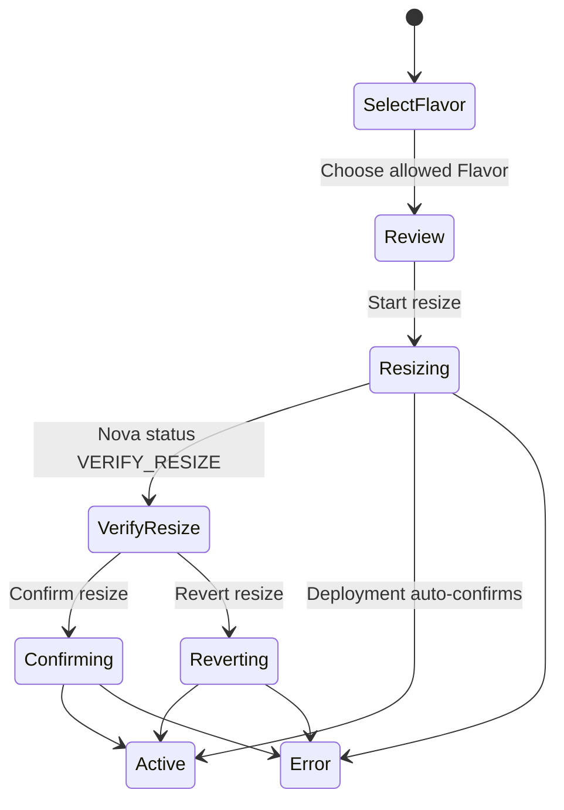

# MVP Mutation Interaction Specification

Status: Goal 1 design-ready, implementation pending user confirmation
Baseline: OpenStack 2026.1
Scope: Goal 1 project-user mutations

Goal 1 is the initial usable MVP. These designs are part of its browser-facing
contract and are represented in `api/openapi.goal1-mvp.yaml`. The published
runtime contract contains only operations implemented by the current slice.

## Shared Boundary

- The browser calls only the Vantage BFF. It never calls Nova, Neutron, Glance,
  or Cinder directly.
- Keystone tokens remain in the server session. Browser requests use only the
  secure Vantage session cookie and CSRF protection.
- Every mutation uses the signed-in user's active project scope. A shared admin
  credential never retries a denied user action.
- Capability discovery and the upstream OpenStack policy response determine
  whether an action is available. UI visibility is not authorization.
- Each accepted asynchronous operation returns a stable Vantage operation ID
  and preserves upstream request IDs for support and audit.
- Duplicate submission is disabled and protected with an idempotency boundary
  appropriate to the operation.

## Common List Pagination

- Every Goal 1 project resource list uses the same visible contract. Design-ahead
  administrator lists reuse this component in Goal 4; they are not part of the
  Goal 1 implementation or acceptance scope:
  `Rows 10/25/50/100`, a result range, and numbered pagination
  `‹ 1 2 3 ... ›`.
- `Previous`, `Prev`, and `Next` text buttons are prohibited. Only the
  directional chevrons flank the page numbers.
- Search, filters, sort, project, and page-size changes reset the visible page
  to 1 and invalidate the BFF cursor map for the prior query.
- The browser sends bounded list requests. The BFF maps visible page numbers to
  Nova, Neutron, Cinder, or Keystone cursor/marker semantics; it never fetches
  an entire collection to paginate in memory.
- The result range and available page buttons reflect server-confirmed data.
  Loading, empty, partial-error, and permission states keep the footer geometry
  stable.

## Common Resource Mutation Pattern

- Every Goal 1 resource row ends with one action menu ordered as `View
  details`, `Edit settings`, relationship/lifecycle commands, then `Delete`.
- The detail surface keeps common mutable fields in `Settings`, less frequent
  or microversion-gated fields in searchable `Advanced`, and sharing or
  assignment controls in `Access` when applicable.
- Create and edit use the same field descriptors. Each descriptor identifies
  the exact OpenStack field, SDK argument, mutability, validation,
  microversion/extension, and policy or state gate.
- A supported set/unset, attach/detach, associate/disassociate, action, or
  delete command cannot be silently absent. A disabled command states why it
  is unavailable.
- Immutable fields remain visible. A resource that must be recreated offers a
  prefilled clone flow instead of pretending an update is supported.
- Every deletable resource has Delete in both the row menu and detail danger
  zone. Storage backends are not deletable resources and never show a fake
  command.

### Shared Delete Confirmation

1. Identify the exact type, name, ID, project, and current state.
2. Load known dependencies without downloading unbounded collections.
3. Explain detach, disassociate, release, retain, and
   delete-on-termination outcomes separately.
4. Require typed name or ID confirmation for an instance with dependencies or
   any administrator-scoped destructive operation.
5. Submit one idempotent command. Force delete, when supported, is a separate
   capability- and policy-gated choice.
6. Keep the row until OpenStack accepts the command. A failed command preserves
   current data and shows the upstream request ID.

## Create Instance

The wizard has four stable steps:

1. `Basics`: name/count, image or supported boot-volume source, Flavor,
   availability zone, and projected quota use.
2. `Network & access`: network or compatible port, fixed IP when requested,
   security groups, key pair, and Floating-IP posture.
3. `Advanced`: description/hostname, metadata, tags, user data, config drive,
   server group/scheduler hints, boot-volume behavior, and other advertised
   microversion fields.
4. `Review`: every effective value, omitted/defaulted values, quota preflight,
   dependency summary, and the final `Launch instance` command.

Advanced fields are searchable and grouped by source, placement, guest
customization, metadata, and storage. Unsupported fields are not submitted.
Sensitive values such as user data or an optional generated password are
write-only, excluded from logs, and shown in review only as present or absent.

## Instance Detail Drawer

- Selecting an instance opens a right drawer over the preserved list.
- The list retains search, filters, page size, cursor, and scroll position.
- List-only controls such as `Rows 25`, result counts, and page buttons do not
  appear in the drawer.
- Overview, Network, Storage, and Events load independently.
- `Edit name` is a direct command. Other lifecycle operations live under
  `Actions` and are filtered by capability, policy, and current server status.

## Edit Instance Name

1. `Edit name` opens a focused dialog with the current Nova display name.
2. `Save name` disables duplicate input and submits through the BFF.
3. Success updates the drawer title and the originating list row without
   changing the server UUID or implying that the guest hostname changed.
4. Validation errors remain inline. `403`, `404`, and `409` use the normalized
   problem response and include an upstream request ID when available.

## Network Interfaces and Security Groups

The Network tab presents user-facing Neutron resources:

- attached network and Nova interface/Neutron port
- fixed IP addresses and port status
- security groups applied to the port
- Floating IP associations

`Attach network` selects either a network or an existing compatible port from a
server-filtered collection. Detach requires confirmation and is unavailable
when the operation would violate a capability or server-state precondition.
The primary-interface warning is explanatory; the upstream API and policy
remain authoritative.

Security-group changes submit the complete intended group set for the selected
port. A revision conflict reloads current port state and asks the user to review
again rather than silently overwriting another change.

## Floating IP Association

1. `Change` opens available Floating IPs and the instance's eligible ports and
   fixed IPs.
2. When a port has multiple fixed IPs, the user must choose the target fixed
   IP explicitly.
3. Association updates the Neutron Floating IP's `port_id` and optional
   `fixed_ip_address` through the BFF.
4. `Disassociate` requires confirmation and sets `port_id` to `null`; it does
   not release the address.
5. Release is a separate destructive command from the Floating IP page.

The product uses Neutron's current Floating IP API, not Nova's deprecated
add/remove Floating IP actions.

## Lifecycle Actions

The actions menu shows only commands supported by the active cloud, allowed by
policy, and valid for the current Nova server state:

- start and stop
- soft and hard reboot
- pause and unpause
- suspend and resume
- shelve and unshelve
- resize
- delete

Every command returns a tracked operation. Conflicting commands remain disabled
until final state or a recoverable error is observed. UI visibility never
overrides Nova policy or a `403`.

Delete appears as the final destructive menu item and in the detail danger
zone. Its confirmation distinguishes boot volumes with
`delete_on_termination`, other attached volumes, attached ports, and allocated
versus associated Floating IPs.

## Resize Instance

### Select and Start

- The Flavor collection is server-filtered and capability-aware.
- The review compares current and requested vCPU, RAM, and disk.
- The BFF rejects the current Flavor, an incompatible disk reduction, a stale
  server state, or another operation already in progress before calling Nova.
- `Start resize` acknowledges the asynchronous operation and moves the drawer
  into a tracked resize state.

### Verify, Confirm, or Revert

- When Nova reports `VERIFY_RESIZE`, the drawer displays the previous Flavor
  and current candidate together.
- `Confirm resize` finalizes the candidate. `Revert resize` restores the
  previous allocation. Both commands are explicit and mutually exclusive while
  pending.
- Some deployments automatically confirm resize. If Nova moves directly to
  `ACTIVE` or `SHUTOFF`, Vantage records that outcome instead of fabricating a
  `VERIFY_RESIZE` step.
- A persistent `VERIFY_RESIZE`, `409`, or failed task keeps both safe recovery
  commands available when policy and server state allow them.

## Command Outcomes

| Command | Pending | Success | Recoverable failure |
| --- | --- | --- | --- |
| Save name | Lock field and buttons | Update title and list row | Keep value, show problem/request ID |
| Attach network | Show port operation | Add interface card | Reload capability/state on 409 |
| Change Floating IP | Lock selected address and port | Update association | Keep old association and show conflict |
| Disassociate Floating IP | Lock association command | Address remains allocated and unbound | Keep current association |
| Start resize | Track Nova task | `VERIFY_RESIZE` or auto-confirmed final state | Restore actions with request ID |
| Confirm resize | Disable Confirm/Revert | Final candidate Flavor | Keep verification state if still valid |
| Revert resize | Disable Confirm/Revert | Previous Flavor restored | Keep verification state if still valid |

## Penpot Boards

- `Vantage - Instance Detail`
- `Vantage - Instance Actions`
- `Vantage - Instance Actions Korean`
- `Vantage - Instance Network`
- `Vantage - Instance NIC Edit`
- `Vantage - Instance Edit Name`
- `Vantage - Instance Resize`
- `Vantage - Instance Resize Verify`
- `Vantage - Instance Delete Confirm`
- `Vantage - Create Instance 1 Basics`
- `Vantage - Create Instance 2 Network`
- `Vantage - Create Instance 3 Advanced`
- `Vantage - Create Instance 4 Review`
- `Vantage - Resource Delete Pattern`
- `Vantage - Images`
- `Vantage - Key Pairs`
- `Vantage - noVNC Console`
- `Vantage - Floating IPs`
- `Vantage - Volumes`
- `Vantage - Volume Detail`

## Promotion Gates

- Goal 1 implementation starts only after the user approves this design and
  planning package.
- Goal 2 full network management follows Goal 1; Goal 3 storage depth and Goal
  4 administrator work follow in order.
- A Penpot board remains design evidence, not proof that a deployed BFF route
  is available. Navigation and actions are capability and rollout gated.

## Official API Anchors

- [Nova Update Server](https://docs.openstack.org/api-ref/compute/#update-server)
- [Nova Resize, Confirm Resize, and Revert Resize](https://docs.openstack.org/api-ref/compute/#servers-run-an-action-servers-action)
- [Nova Port Interfaces](https://docs.openstack.org/api-ref/compute/#port-interfaces-servers-os-interface)
- [Neutron Floating IPs](https://docs.openstack.org/api-ref/network/v2/#floating-ips-floatingips)
